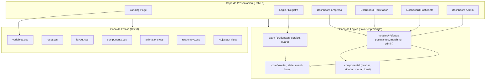
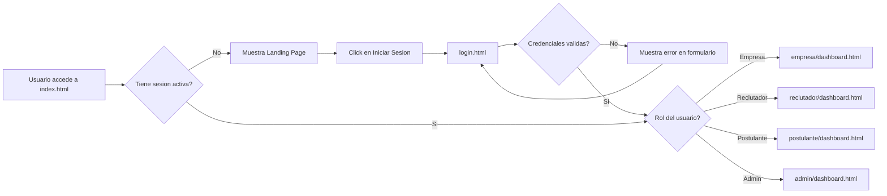

# TalentMatch AI -- Plan de Desarrollo y Arquitectura Frontend

> Documento de referencia tecnica para la implementacion integral del frontend.
> Version: 1.0 | Fecha: 2026-10-01 | Autor: Arquitecto Frontend / Technical Lead

---

## Tabla de Contenidos

1. [Evaluacion Logica](#1-evaluacion-logica)
2. [Resumen de la Arquitectura Frontend](#2-resumen-de-la-arquitectura-frontend)
3. [Mapa del Sitio (Sitemap)](#3-mapa-del-sitio-sitemap)
4. [Guia de Estilos y UI/UX](#4-guia-de-estilos-y-uiux)
5. [Logica de Navegacion y Simulacion de Estado](#5-logica-de-navegacion-y-simulacion-de-estado)
6. [Estructura de Directorios](#6-estructura-de-directorios)
7. [Prompts de Ejecucion](#7-prompts-de-ejecucion)

---

## 1. Evaluacion Logica

### 1.1. Analisis de la Estrategia de Arquitectura

La plataforma TalentMatch AI opera con cuatro roles de usuario diferenciados (Empresa, Reclutador, Postulante, Administrador), cada uno con vistas y funcionalidades propias. Esto impone una arquitectura **modular por dominio**, donde cada rol tiene su propio directorio de vistas y sus modulos JavaScript especificos, pero comparte una capa de componentes reutilizables (navbar, sidebar, modales, tarjetas).

La decision arquitectonica principal es organizar el codigo por **dominios funcionales** en lugar de por tipo de archivo. Esto significa que en lugar de agrupar todos los CSS juntos y todos los JS juntos de forma plana, se mantiene una jerarquia donde los archivos compartidos viven en directorios `core/` o `shared/`, y los especificos de cada dominio viven en su directorio correspondiente. Este patron facilita la futura migracion a PHP (Laravel Blade, por ejemplo), donde cada directorio de vistas se convierte en un directorio de templates y cada modulo JS se puede mantener o reemplazar con logica backend.

### 1.2. Resolucion de la Simulacion de Login

El sistema de autenticacion simulada funcionara de la siguiente manera:

1. Un archivo `js/auth/credentials-store.js` contendra un objeto JavaScript con las credenciales preestablecidas de los cuatro roles. Este archivo actua como un **adaptador temporal** que en produccion sera reemplazado por una llamada HTTP a un endpoint de autenticacion.
2. El archivo `js/auth/auth-service.js` expone una funcion `authenticate(email, password)` que valida contra el store y, si es exitoso, guarda la sesion en `sessionStorage` (clave `tm_session`) con los datos del usuario y su rol.
3. Un archivo `js/auth/auth-guard.js` se ejecuta al inicio de cada pagina protegida. Verifica que exista una sesion valida en `sessionStorage`. Si no existe, redirige a `login.html`. Si existe pero el rol no tiene acceso a esa vista, redirige a la vista correspondiente al rol del usuario.
4. El logout destruye la sesion y redirige al login.

Este patron de tres archivos (store, service, guard) establece una **interfaz clara** que cualquier backend puede sustituir sin modificar la estructura de vistas ni la logica de navegacion.

### 1.3. Organizacion de Archivos para Migracion a PHP

Cada vista HTML esta disenada como una unidad autonoma con:
- Estructura semantica completa (header, main, footer/sidebar).
- Referencias a hojas de estilo CSS via `<link>` con rutas relativas consistentes.
- Referencias a scripts JS via `<script>` al final del `<body>`, con carga diferida (`defer`).

Esta estructura permite que cada archivo `.html` se renombre a `.blade.php` (o el motor de templates elegido) y se integre con un layout maestro (master layout) manteniendo la misma organizacion de directorio. Los archivos CSS y JS permanecen intactos. La logica de autenticacion del guard se reemplaza por middleware del backend.

### 1.4. Estrategia de Diseno Visual

El diseno adopta un enfoque **minimalista de alta densidad controlada**: cada vista muestra solo la informacion esencial con abundante espacio en blanco, tipografia limpia y jerarquia visual marcada por color y tamano. Los tonos rojos se utilizan como color de accion primaria (botones, estados activos, acentos), nunca como color de fondo dominante, para evitar fatiga visual. El negro y gris oscuro se reservan para texto y estructura; el blanco y gris claro para fondos y superficies.

---

## 2. Resumen de la Arquitectura Frontend

### 2.1. Principios Rectores

| Principio | Aplicacion en el Proyecto |
|---|---|
| **Modularidad por dominio** | Cada rol (empresa, reclutador, postulante, admin) tiene su propio directorio de vistas y modulos JS. |
| **Separacion de responsabilidades** | HTML define estructura, CSS define presentacion, JS define comportamiento. Nunca se mezclan. |
| **Interfaz pequena, implementacion profunda** | Los modulos JS exponen funciones con parametros simples pero encapsulan toda la complejidad interna. |
| **Componentes reutilizables** | Navbar, sidebar, modales, tarjetas de oferta y de candidato son componentes compartidos con parametrizacion via atributos `data-*`. |
| **Escalabilidad para migracion** | Cada archivo HTML es un template autonomo. Cada archivo JS es un modulo con dependencias explicitas. No hay logica de negocio incrustada en el DOM. |
| **Accesibilidad base** | Uso correcto de etiquetas semanticas (`<nav>`, `<main>`, `<section>`, `<article>`), atributos `aria-label`, `role`, y contraste de color conforme a WCAG AA. |

### 2.2. Diagrama de Arquitectura de Alto Nivel



### 2.3. Flujo de Interaccion del Usuario



---

## 3. Mapa del Sitio (Sitemap)

### 3.1. Vista General del Sitemap

```mermaid
flowchart TD
    INDEX["index.html<br/>Landing Page"]
    LOGIN["auth/login.html"]
    REG_E["auth/registro-empresa.html"]
    REG_P["auth/registro-postulante.html"]

    subgraph EMPRESA["Vistas Empresa"]
        ED["empresa/dashboard.html"]
        EO["empresa/ofertas.html"]
        EOF["empresa/oferta-formulario.html"]
        EOD["empresa/oferta-detalle.html"]
        EP["empresa/perfil.html"]
    end

    subgraph RECLUTADOR["Vistas Reclutador"]
        RD["reclutador/dashboard.html"]
        RO["reclutador/ofertas.html"]
        RC["reclutador/candidatos.html"]
        RM["reclutador/matching.html"]
        RCD["reclutador/candidato-detalle.html"]
    end

    subgraph POSTULANTE["Vistas Postulante"]
        PD["postulante/dashboard.html"]
        PP["postulante/perfil.html"]
        PE["postulante/experiencia.html"]
        PF["postulante/formacion.html"]
        POF["postulante/ofertas-disponibles.html"]
        PA["postulante/aplicaciones.html"]
    end

    subgraph ADMIN["Vistas Administrador"]
        AD["admin/dashboard.html"]
        AU["admin/usuarios.html"]
        AC["admin/catalogos.html"]
        AP["admin/parametros.html"]
    end

    INDEX --> LOGIN
    INDEX --> REG_E
    INDEX --> REG_P
    LOGIN --> ED
    LOGIN --> RD
    LOGIN --> PD
    LOGIN --> AD
```



### 3.2. Inventario Detallado de Vistas

| ID | Archivo | Titulo de Vista | Rol Requerido | Descripcion Funcional |
|---|---|---|---|---|
| V-01 | `index.html` | TalentMatch AI | Publico | Landing page con propuesta de valor, seccion de funcionalidades, llamadas a la accion para registro y login. |
| V-02 | `auth/login.html` | Iniciar Sesion | Publico | Formulario de autenticacion con campos email y contrasena, boton de ingreso, enlaces a registro. |
| V-03 | `auth/registro-empresa.html` | Registro de Empresa | Publico | Formulario de registro para empresa: nombre, RUC/NIT, sector, correo corporativo, contrasena. |
| V-04 | `auth/registro-postulante.html` | Registro de Postulante | Publico | Formulario de registro para postulante: nombre completo, correo, contrasena, area de interes. |
| V-05 | `empresa/dashboard.html` | Panel de Empresa | Empresa | Dashboard con metricas: ofertas activas, total de postulaciones recibidas, ofertas recientes, accesos rapidos. |
| V-06 | `empresa/ofertas.html` | Mis Ofertas Laborales | Empresa | Listado de ofertas creadas por la empresa con filtros por estado (activa, cerrada, en revision). |
| V-07 | `empresa/oferta-formulario.html` | Crear / Editar Oferta | Empresa | Formulario completo para crear o editar una oferta laboral con todos los campos especificados en el contexto del proyecto. |
| V-08 | `empresa/oferta-detalle.html` | Detalle de Oferta | Empresa | Vista de lectura de una oferta con lista de postulantes que han aplicado y su porcentaje de coincidencia. |
| V-09 | `empresa/perfil.html` | Perfil de Empresa | Empresa | Formulario editable con datos institucionales de la empresa. |
| V-10 | `reclutador/dashboard.html` | Panel de Reclutador | Reclutador | Dashboard con metricas: ofertas asignadas, candidatos por revisar, ultimos resultados de matching. |
| V-11 | `reclutador/ofertas.html` | Ofertas Asignadas | Reclutador | Listado de ofertas que el reclutador debe gestionar, con filtro por estado y prioridad. |
| V-12 | `reclutador/candidatos.html` | Candidatos | Reclutador | Listado de candidatos con filtros por competencias, experiencia, formacion. Incluye puntaje de matching. |
| V-13 | `reclutador/matching.html` | Analisis de Matching | Reclutador | Vista de resultados de matching entre una oferta y los candidatos, con visualizacion de porcentaje y desglose de coincidencias. |
| V-14 | `reclutador/candidato-detalle.html` | Detalle de Candidato | Reclutador | Ficha completa del candidato: perfil, experiencia, formacion, competencias, CV adjunto, puntaje por categoria. |
| V-15 | `postulante/dashboard.html` | Mi Panel | Postulante | Dashboard con estado de aplicaciones, ofertas sugeridas, completitud del perfil (barra de progreso). |
| V-16 | `postulante/perfil.html` | Mi Perfil Profesional | Postulante | Formulario editable con datos personales, competencias, tecnologias, idiomas, certificaciones, expectativas laborales. |
| V-17 | `postulante/experiencia.html` | Experiencia Laboral | Postulante | Formulario para agregar, editar y eliminar registros de experiencia laboral (empresa, cargo, periodo, funciones). |
| V-18 | `postulante/formacion.html` | Formacion Academica | Postulante | Formulario para agregar, editar y eliminar registros de formacion (institucion, titulo, ano, area). |
| V-19 | `postulante/ofertas-disponibles.html` | Ofertas Disponibles | Postulante | Listado de ofertas publicadas con filtros por area, modalidad, ubicacion. Permite aplicar a una oferta. |
| V-20 | `postulante/aplicaciones.html` | Mis Aplicaciones | Postulante | Historial de aplicaciones realizadas con estado (enviada, en revision, preseleccionado, descartado). |
| V-21 | `admin/dashboard.html` | Panel de Administracion | Admin | Dashboard con metricas globales: total usuarios, ofertas, postulaciones, actividad reciente. |
| V-22 | `admin/usuarios.html` | Gestion de Usuarios | Admin | Tabla de usuarios con filtros por rol, estado y fecha. Permite activar, desactivar y editar roles. |
| V-23 | `admin/catalogos.html` | Gestion de Catalogos | Admin | ABM de catalogos del sistema: areas, competencias, tecnologias, idiomas, niveles de formacion. |
| V-24 | `admin/parametros.html` | Parametros del Sistema | Admin | Configuracion de parametros generales: umbral de matching, formatos permitidos de CV, limite de ofertas activas. |

### 3.3. Componentes Compartidos (Insertados Dinamicamente via JS)

| Componente | Archivo JS | Descripcion |
|---|---|---|
| Navbar | `js/components/navbar.js` | Barra superior con logo, nombre de usuario, menu desplegable de perfil, boton de logout. Se adapta segun el rol. |
| Sidebar | `js/components/sidebar.js` | Menu lateral de navegacion con iconos y etiquetas. El contenido del menu cambia segun el rol del usuario autenticado. |
| Modal | `js/components/modal.js` | Componente de dialogo modal reutilizable. Acepta titulo, contenido HTML y acciones (confirmar/cancelar). |
| Toast | `js/components/toast.js` | Notificaciones temporales (exito, error, informacion) que aparecen en la esquina superior derecha y se desvanecen. |
| Tarjeta de Oferta | `js/components/oferta-card.js` | Tarjeta reutilizable que muestra resumen de una oferta laboral (titulo, empresa, ubicacion, modalidad). |
| Tarjeta de Candidato | `js/components/candidato-card.js` | Tarjeta reutilizable que muestra resumen de un candidato (nombre, area, puntaje de matching). |
| Barra de Progreso | `js/components/progress-bar.js` | Barra de progreso con porcentaje, utilizada para completitud de perfil y puntaje de matching. |
| Tabla de Datos | `js/components/data-table.js` | Tabla con ordenamiento por columna, paginacion y busqueda integrada. |
| Cargador (Loader) | `js/components/loader.js` | Overlay de carga con animacion de spinner, se muestra durante transiciones de pagina simuladas. |

---

## 4. Guia de Estilos y UI/UX

### 4.1. Paleta de Colores

La paleta se estructura en cuatro categorias funcionales: primarios (tonos rojos), neutrales, semanticos y superficies.

#### Colores Primarios (Tonos Rojos)

| Nombre de Variable CSS | Hexadecimal | Uso |
|---|---|---|
| `--color-primary-900` | `#4A0404` | Sombras profundas, estados pressed en botones |
| `--color-primary-800` | `#7F0000` | Bordes activos, acentos oscuros |
| `--color-primary-700` | `#B71C1C` | **Color primario principal.** Botones, enlaces activos, iconos de accion. |
| `--color-primary-600` | `#C62828` | Hover en botones primarios |
| `--color-primary-500` | `#D32F2F` | Elementos interactivos secundarios |
| `--color-primary-400` | `#E53935` | Badges, indicadores numericos |
| `--color-primary-300` | `#EF5350` | Estados hover sutiles |
| `--color-primary-200` | `#EF9A9A` | Bordes de seleccion, fondos de elementos seleccionados |
| `--color-primary-100` | `#FFCDD2` | Fondos de alertas, fondos de tarjetas destacadas |
| `--color-primary-50` | `#FFEBEE` | Fondos muy sutiles, hover en filas de tabla |

#### Colores Neutrales

| Nombre de Variable CSS | Hexadecimal | Uso |
|---|---|---|
| `--color-neutral-900` | `#1A1A2E` | Texto principal, titulos |
| `--color-neutral-800` | `#2D2D44` | Texto de cuerpo, sidebar oscuro |
| `--color-neutral-700` | `#4A4A68` | Texto secundario |
| `--color-neutral-600` | `#6B6B8D` | Placeholders, texto de ayuda |
| `--color-neutral-500` | `#9E9EBF` | Iconos inactivos, bordes |
| `--color-neutral-400` | `#B8B8D4` | Bordes sutiles |
| `--color-neutral-300` | `#D1D1E9` | Divisores |
| `--color-neutral-200` | `#E8E8F0` | Fondos de inputs, bordes de tarjetas |
| `--color-neutral-100` | `#F4F4F8` | Fondo general de la aplicacion |
| `--color-neutral-50` | `#FAFAFE` | Fondo de tarjetas, superficies elevadas |
| `--color-white` | `#FFFFFF` | Fondo de modales, fondo de formularios |

#### Colores Semanticos

| Nombre de Variable CSS | Hexadecimal | Uso |
|---|---|---|
| `--color-success` | `#2E7D32` | Confirmaciones, estados aprobados |
| `--color-success-light` | `#E8F5E9` | Fondo de alertas de exito |
| `--color-warning` | `#F57F17` | Advertencias, estados pendientes |
| `--color-warning-light` | `#FFF8E1` | Fondo de alertas de advertencia |
| `--color-error` | `#C62828` | Errores de validacion, estados de rechazo |
| `--color-error-light` | `#FFEBEE` | Fondo de alertas de error |
| `--color-info` | `#1565C0` | Informacion, enlaces, estados neutros |
| `--color-info-light` | `#E3F2FD` | Fondo de alertas informativas |

#### Superficies y Elevaciones

| Nombre de Variable CSS | Valor | Uso |
|---|---|---|
| `--shadow-xs` | `0 1px 2px rgba(0,0,0,0.05)` | Tarjetas en reposo |
| `--shadow-sm` | `0 2px 4px rgba(0,0,0,0.08)` | Tarjetas en hover |
| `--shadow-md` | `0 4px 12px rgba(0,0,0,0.12)` | Dropdowns, tooltips |
| `--shadow-lg` | `0 8px 24px rgba(0,0,0,0.16)` | Modales |
| `--shadow-xl` | `0 12px 48px rgba(0,0,0,0.20)` | Elementos flotantes principales |

### 4.2. Tipografia

| Propiedad | Valor |
|---|---|
| **Familia principal** | `'Inter', -apple-system, BlinkMacSystemFont, 'Segoe UI', sans-serif` |
| **Familia monoespaciada** | `'JetBrains Mono', 'Fira Code', 'Consolas', monospace` |
| **Carga** | Google Fonts: `Inter` pesos 400, 500, 600, 700 |

#### Escala Tipografica

| Variable CSS | Tamano | Peso | Uso |
|---|---|---|---|
| `--text-display` | `2.25rem (36px)` | 700 | Titulo principal del landing |
| `--text-h1` | `1.875rem (30px)` | 700 | Titulos de pagina |
| `--text-h2` | `1.5rem (24px)` | 600 | Titulos de seccion |
| `--text-h3` | `1.25rem (20px)` | 600 | Subtitulos |
| `--text-h4` | `1.125rem (18px)` | 600 | Titulos de tarjeta |
| `--text-body` | `1rem (16px)` | 400 | Texto de cuerpo general |
| `--text-body-sm` | `0.875rem (14px)` | 400 | Texto secundario, captions |
| `--text-caption` | `0.75rem (12px)` | 500 | Etiquetas, badges, metadatos |
| `--text-overline` | `0.6875rem (11px)` | 600 | Overlines, categorias (uppercase, letter-spacing 0.08em) |

#### Interlineado

| Variable CSS | Valor |
|---|---|
| `--leading-tight` | `1.25` |
| `--leading-normal` | `1.5` |
| `--leading-relaxed` | `1.75` |

### 4.3. Espaciado

Sistema de espaciado basado en multiplos de 4px:

| Variable CSS | Valor |
|---|---|
| `--space-1` | `0.25rem (4px)` |
| `--space-2` | `0.5rem (8px)` |
| `--space-3` | `0.75rem (12px)` |
| `--space-4` | `1rem (16px)` |
| `--space-5` | `1.25rem (20px)` |
| `--space-6` | `1.5rem (24px)` |
| `--space-8` | `2rem (32px)` |
| `--space-10` | `2.5rem (40px)` |
| `--space-12` | `3rem (48px)` |
| `--space-16` | `4rem (64px)` |
| `--space-20` | `5rem (80px)` |

### 4.4. Bordes y Radios

| Variable CSS | Valor | Uso |
|---|---|---|
| `--radius-sm` | `4px` | Badges, chips |
| `--radius-md` | `8px` | Botones, inputs |
| `--radius-lg` | `12px` | Tarjetas |
| `--radius-xl` | `16px` | Modales |
| `--radius-full` | `9999px` | Avatares, botones circulares |

### 4.5. Especificaciones de Componentes UI

#### Botones

| Variante | Fondo | Texto | Borde | Hover | Active |
|---|---|---|---|---|---|
| **Primario** | `--color-primary-700` | `#FFFFFF` | ninguno | `--color-primary-600` + `--shadow-sm` | `--color-primary-800` |
| **Secundario** | `transparent` | `--color-primary-700` | `1px solid --color-primary-700` | `--color-primary-50` | `--color-primary-100` |
| **Ghost** | `transparent` | `--color-neutral-700` | ninguno | `--color-neutral-100` | `--color-neutral-200` |
| **Danger** | `--color-error` | `#FFFFFF` | ninguno | `--color-primary-900` | `--color-primary-900` |

Especificaciones dimensionales de botones:
- Padding: `--space-3` vertical, `--space-6` horizontal.
- Border-radius: `--radius-md`.
- Font-size: `--text-body-sm` (14px).
- Font-weight: 600.
- Min-height: 40px.
- Cursor: pointer.
- Transition: `all 200ms cubic-bezier(0.4, 0, 0.2, 1)`.

#### Inputs de Formulario

- Height: 44px.
- Padding: `--space-3` horizontal.
- Border: `1px solid var(--color-neutral-300)`.
- Border-radius: `--radius-md`.
- Font-size: `--text-body` (16px).
- Focus: borde cambia a `--color-primary-700`, aparece `box-shadow: 0 0 0 3px var(--color-primary-100)`.
- Placeholder color: `--color-neutral-500`.
- Label: posicionado arriba del input, font-size `--text-body-sm`, font-weight 500, color `--color-neutral-700`.
- Transition: `border-color 200ms ease, box-shadow 200ms ease`.

#### Tarjetas

- Background: `--color-white`.
- Border: `1px solid var(--color-neutral-200)`.
- Border-radius: `--radius-lg`.
- Padding: `--space-6`.
- Shadow en reposo: `--shadow-xs`.
- Shadow en hover: `--shadow-sm`.
- Transition: `box-shadow 250ms cubic-bezier(0.4, 0, 0.2, 1), transform 250ms cubic-bezier(0.4, 0, 0.2, 1)`.
- Transform en hover: `translateY(-2px)`.

#### Sidebar de Navegacion

- Ancho: 260px (expandido), 72px (colapsado).
- Background: `--color-neutral-900`.
- Item de menu activo: fondo `rgba(183, 28, 28, 0.15)`, borde izquierdo `3px solid var(--color-primary-700)`, texto `--color-primary-300`.
- Item de menu hover: fondo `rgba(255, 255, 255, 0.05)`.
- Icono: 20x20px, margen derecho `--space-3`.
- Transicion de colapso: `width 300ms cubic-bezier(0.4, 0, 0.2, 1)`.

### 4.6. Especificaciones de Animaciones y Micro-Interacciones

#### Curvas de Aceleracion (Easing Functions)

| Variable CSS | Valor | Uso |
|---|---|---|
| `--ease-standard` | `cubic-bezier(0.4, 0, 0.2, 1)` | Transiciones generales (la mas usada) |
| `--ease-decelerate` | `cubic-bezier(0.0, 0, 0.2, 1)` | Elementos que entran a la pantalla |
| `--ease-accelerate` | `cubic-bezier(0.4, 0, 1, 1)` | Elementos que salen de la pantalla |
| `--ease-sharp` | `cubic-bezier(0.4, 0, 0.6, 1)` | Microinteracciones rapidas |

#### Duraciones

| Variable CSS | Valor | Uso |
|---|---|---|
| `--duration-instant` | `100ms` | Feedback inmediato (ripple, toggle) |
| `--duration-fast` | `200ms` | Hover de botones, cambio de color |
| `--duration-normal` | `300ms` | Apertura de modales, transiciones de sidebar |
| `--duration-slow` | `500ms` | Transiciones de pagina, animaciones de entrada |

#### Animaciones Especificas por Componente

**Carga de pagina:**
```css
@keyframes tm-fade-in {
  from { opacity: 0; transform: translateY(12px); }
  to { opacity: 1; transform: translateY(0); }
}
/* Aplicar a <main>: animation: tm-fade-in var(--duration-slow) var(--ease-decelerate); */
```

**Apertura de modal:**
```css
@keyframes tm-modal-enter {
  from { opacity: 0; transform: scale(0.95) translateY(8px); }
  to { opacity: 1; transform: scale(1) translateY(0); }
}
@keyframes tm-overlay-enter {
  from { opacity: 0; }
  to { opacity: 1; }
}
/* Modal: animation: tm-modal-enter var(--duration-normal) var(--ease-decelerate); */
/* Overlay: animation: tm-overlay-enter var(--duration-fast) ease-out; background: rgba(0,0,0,0.5); */
```

**Toast (notificacion):**
```css
@keyframes tm-toast-enter {
  from { opacity: 0; transform: translateX(100%); }
  to { opacity: 1; transform: translateX(0); }
}
@keyframes tm-toast-exit {
  from { opacity: 1; transform: translateX(0); }
  to { opacity: 0; transform: translateX(100%); }
}
/* Duracion visible: 4000ms. Duracion animacion: var(--duration-normal). */
```

**Hover en tarjetas:**
```css
.tm-card {
  transition: box-shadow var(--duration-fast) var(--ease-standard),
              transform var(--duration-fast) var(--ease-standard);
}
.tm-card:hover {
  box-shadow: var(--shadow-sm);
  transform: translateY(-2px);
}
```

**Boton ripple (efecto al hacer clic):**
```css
@keyframes tm-ripple {
  from { transform: scale(0); opacity: 0.4; }
  to { transform: scale(2.5); opacity: 0; }
}
/* Implementar via JS: crear <span> dentro del boton con posicion absoluta en el punto de clic. */
```

**Sidebar toggle:**
```css
.tm-sidebar {
  transition: width var(--duration-normal) var(--ease-standard);
}
.tm-sidebar__label {
  transition: opacity var(--duration-fast) var(--ease-accelerate);
}
```

**Barra de progreso:**
```css
@keyframes tm-progress-fill {
  from { width: 0%; }
  to { width: var(--progress-value); }
}
/* Duracion: var(--duration-slow). Easing: var(--ease-decelerate). */
```

**Skeleton loading (placeholder de carga):**
```css
@keyframes tm-skeleton-pulse {
  0% { background-position: -200px 0; }
  100% { background-position: calc(200px + 100%) 0; }
}
/* background: linear-gradient(90deg, var(--color-neutral-200) 25%, var(--color-neutral-100) 50%, var(--color-neutral-200) 75%); */
/* background-size: 200px 100%; animation: tm-skeleton-pulse 1.5s infinite; */
```

### 4.7. Breakpoints Responsivos

| Nombre | Valor | Comportamiento |
|---|---|---|
| **Mobile** | `< 640px` | Sidebar oculto (menu hamburguesa), layout en columna unica. |
| **Tablet** | `640px - 1023px` | Sidebar colapsado (solo iconos), grid de 2 columnas en dashboards. |
| **Desktop** | `1024px - 1439px` | Sidebar expandido, grid de 3 columnas en dashboards. |
| **Wide** | `>= 1440px` | Contenido centrado con max-width de 1400px, grid de 4 columnas. |

### 4.8. Layout del Dashboard (Estructura de Grilla)

Todos los dashboards comparten esta estructura CSS Grid:

```css
.tm-dashboard-layout {
  display: grid;
  grid-template-columns: auto 1fr;     /* sidebar + contenido */
  grid-template-rows: 64px 1fr;        /* navbar + contenido */
  grid-template-areas:
    "sidebar navbar"
    "sidebar main";
  min-height: 100vh;
}

.tm-navbar   { grid-area: navbar; }
.tm-sidebar  { grid-area: sidebar; }
.tm-main     { grid-area: main; padding: var(--space-8); overflow-y: auto; }
```

Dentro de `.tm-main`, las tarjetas de metricas se organizan con:
```css
.tm-metrics-grid {
  display: grid;
  grid-template-columns: repeat(auto-fit, minmax(240px, 1fr));
  gap: var(--space-6);
}
```

---

## 5. Logica de Navegacion y Simulacion de Estado

### 5.1. Almacen de Credenciales

Archivo: `js/auth/credentials-store.js`

```javascript
/**
 * TalentMatch AI -- Almacen de Credenciales Simuladas
 * 
 * NOTA DE MIGRACION: Este archivo sera eliminado en produccion.
 * La autenticacion se delegara al endpoint POST /api/auth/login del backend.
 * 
 * Cada entrada define:
 *   - email: Correo electronico del usuario (clave de busqueda).
 *   - password: Contrasena del usuario.
 *   - role: Rol asignado (empresa | reclutador | postulante | admin).
 *   - name: Nombre visible del usuario en la interfaz.
 *   - avatar: Iniciales para el avatar circular.
 *   - redirect: Ruta de redireccion tras autenticacion exitosa.
 */
const TM_CREDENTIALS = {
  "empresa@talentmatch.com": {
    password: "Empresa2026*",
    role: "empresa",
    name: "TechCorp Internacional S.A.",
    avatar: "TC",
    redirect: "empresa/dashboard.html"
  },
  "reclutador@talentmatch.com": {
    password: "Reclutador2026*",
    role: "reclutador",
    name: "Ana Patricia Martinez",
    avatar: "AM",
    redirect: "reclutador/dashboard.html"
  },
  "postulante@talentmatch.com": {
    password: "Postulante2026*",
    role: "postulante",
    name: "Carlos Eduardo Lopez",
    avatar: "CL",
    redirect: "postulante/dashboard.html"
  },
  "admin@talentmatch.com": {
    password: "Admin2026*",
    role: "admin",
    name: "Administrador del Sistema",
    avatar: "AS",
    redirect: "admin/dashboard.html"
  }
};
```

### 5.2. Tabla de Credenciales para Validacion

| Rol | Email | Contrasena | Dashboard de Destino |
|---|---|---|---|
| Empresa | `empresa@talentmatch.com` | `Empresa2026*` | `empresa/dashboard.html` |
| Reclutador | `reclutador@talentmatch.com` | `Reclutador2026*` | `reclutador/dashboard.html` |
| Postulante | `postulante@talentmatch.com` | `Postulante2026*` | `postulante/dashboard.html` |
| Administrador | `admin@talentmatch.com` | `Admin2026*` | `admin/dashboard.html` |

### 5.3. Servicio de Autenticacion

Archivo: `js/auth/auth-service.js`

Interfaz publica del modulo:

| Funcion | Parametros | Retorno | Descripcion |
|---|---|---|---|
| `authenticate(email, password)` | `string, string` | `{ success: boolean, user: object, error: string }` | Valida credenciales contra el store. Si es exitoso, guarda sesion en `sessionStorage` bajo la clave `tm_session` y retorna los datos del usuario. |
| `logout()` | ninguno | `void` | Elimina `tm_session` de `sessionStorage` y redirige a `auth/login.html`. |
| `getCurrentUser()` | ninguno | `object \| null` | Retorna el objeto de sesion parseado desde `sessionStorage`, o `null` si no hay sesion. |
| `isAuthenticated()` | ninguno | `boolean` | Retorna `true` si existe una sesion valida en `sessionStorage`. |
| `getUserRole()` | ninguno | `string \| null` | Retorna el rol del usuario autenticado, o `null`. |

Estructura del objeto de sesion almacenado en `sessionStorage`:
```json
{
  "email": "empresa@talentmatch.com",
  "role": "empresa",
  "name": "TechCorp Internacional S.A.",
  "avatar": "TC",
  "loginTimestamp": 1727812345678
}
```

### 5.4. Guardia de Autenticacion

Archivo: `js/auth/auth-guard.js`

Este script se ejecuta al inicio de cada pagina protegida (todas excepto `index.html`, `auth/login.html`, `auth/registro-empresa.html` y `auth/registro-postulante.html`).

Logica de ejecucion:

1. Invocar `isAuthenticated()`.
2. Si retorna `false`, redirigir a `auth/login.html`.
3. Si retorna `true`, obtener el rol via `getUserRole()`.
4. Extraer el segmento de directorio de la URL actual (ej. de `empresa/dashboard.html` extraer `empresa`).
5. Comparar el rol con el directorio. Si no coinciden, redirigir al dashboard correcto del rol.
6. Si todo es correcto, permitir la carga normal de la pagina.

Mapa de permisos por directorio:

| Directorio de Vista | Roles Permitidos |
|---|---|
| `empresa/` | `empresa` |
| `reclutador/` | `reclutador` |
| `postulante/` | `postulante` |
| `admin/` | `admin` |

### 5.5. Bus de Eventos

Archivo: `js/core/event-bus.js`

Un sistema publish/subscribe liviano para comunicacion entre componentes sin acoplamiento directo.

| Metodo | Parametros | Descripcion |
|---|---|---|
| `on(eventName, callback)` | `string, function` | Registra un listener para un evento. |
| `off(eventName, callback)` | `string, function` | Remueve un listener. |
| `emit(eventName, data)` | `string, any` | Dispara un evento con datos opcionales. |

Eventos predefinidos del sistema:

| Evento | Emitido por | Datos | Consumido por |
|---|---|---|---|
| `auth:login` | auth-service | `{ user }` | navbar, sidebar |
| `auth:logout` | auth-service | ninguno | navbar, sidebar, guard |
| `toast:show` | cualquier modulo | `{ message, type, duration }` | toast component |
| `modal:open` | cualquier modulo | `{ title, content, actions }` | modal component |
| `modal:close` | modal component | ninguno | cualquier modulo |
| `sidebar:toggle` | navbar | ninguno | sidebar component |
| `data:refresh` | modulos de datos | `{ entity }` | tablas, listas |

### 5.6. Gestor de Estado Simulado

Archivo: `js/core/state-manager.js`

Para simular datos sin backend, cada modulo de datos (ofertas, postulantes, matching) tendra un archivo JS con datos estáticos que actuan como la "base de datos" del frontend. El state-manager provee una interfaz CRUD generica sobre estos datos almacenados en memoria.

| Metodo | Parametros | Retorno | Descripcion |
|---|---|---|---|
| `getAll(entity)` | `string` | `array` | Retorna todos los registros de una entidad. |
| `getById(entity, id)` | `string, string` | `object \| null` | Retorna un registro por ID. |
| `create(entity, data)` | `string, object` | `object` | Agrega un registro (genera ID). |
| `update(entity, id, data)` | `string, string, object` | `object` | Actualiza un registro existente. |
| `remove(entity, id)` | `string, string` | `boolean` | Elimina un registro. |
| `filter(entity, predicate)` | `string, function` | `array` | Filtra registros por predicado. |

Entidades simuladas:

| Entidad | Archivo de Datos | Campos Principales |
|---|---|---|
| `ofertas` | `js/data/ofertas-data.js` | id, titulo, empresa, area, descripcion, requisitos, modalidad, ubicacion, estado, fechaCreacion |
| `postulantes` | `js/data/postulantes-data.js` | id, nombre, email, formacion, experiencia, competencias, tecnologias, idiomas, cvUrl |
| `aplicaciones` | `js/data/aplicaciones-data.js` | id, ofertaId, postulanteId, estado, fechaAplicacion, puntajeMatching |
| `empresas` | `js/data/empresas-data.js` | id, nombre, ruc, sector, correo, descripcion |
| `usuarios` | `js/data/usuarios-data.js` | id, nombre, email, rol, estado, fechaRegistro |
| `catalogos` | `js/data/catalogos-data.js` | id, tipo, nombre, activo |

---

## 6. Estructura de Directorios

```
talentmatch-ai/
|
|-- index.html                              # V-01: Landing Page
|
|-- auth/
|   |-- login.html                          # V-02: Inicio de Sesion
|   |-- registro-empresa.html               # V-03: Registro de Empresa
|   |-- registro-postulante.html            # V-04: Registro de Postulante
|
|-- empresa/
|   |-- dashboard.html                      # V-05: Panel de Empresa
|   |-- ofertas.html                        # V-06: Listado de Ofertas
|   |-- oferta-formulario.html              # V-07: Crear/Editar Oferta
|   |-- oferta-detalle.html                 # V-08: Detalle de Oferta
|   |-- perfil.html                         # V-09: Perfil de Empresa
|
|-- reclutador/
|   |-- dashboard.html                      # V-10: Panel de Reclutador
|   |-- ofertas.html                        # V-11: Ofertas Asignadas
|   |-- candidatos.html                     # V-12: Listado de Candidatos
|   |-- matching.html                       # V-13: Analisis de Matching
|   |-- candidato-detalle.html              # V-14: Detalle de Candidato
|
|-- postulante/
|   |-- dashboard.html                      # V-15: Mi Panel
|   |-- perfil.html                         # V-16: Mi Perfil Profesional
|   |-- experiencia.html                    # V-17: Experiencia Laboral
|   |-- formacion.html                      # V-18: Formacion Academica
|   |-- ofertas-disponibles.html            # V-19: Ofertas Disponibles
|   |-- aplicaciones.html                   # V-20: Mis Aplicaciones
|
|-- admin/
|   |-- dashboard.html                      # V-21: Panel de Administracion
|   |-- usuarios.html                       # V-22: Gestion de Usuarios
|   |-- catalogos.html                      # V-23: Gestion de Catalogos
|   |-- parametros.html                     # V-24: Parametros del Sistema
|
|-- css/
|   |-- variables.css                       # Variables CSS: colores, tipografia, espaciado, sombras, animaciones
|   |-- reset.css                           # Normalize/reset de estilos del navegador
|   |-- layout.css                          # Grid del dashboard, containers, sistema de columnas
|   |-- components.css                      # Estilos de botones, inputs, tarjetas, badges, tablas
|   |-- animations.css                      # Keyframes y clases de animacion
|   |-- responsive.css                      # Media queries para todos los breakpoints
|   |-- pages/
|       |-- landing.css                     # Estilos exclusivos del landing page
|       |-- auth.css                        # Estilos de formularios de login y registro
|       |-- dashboard.css                   # Estilos compartidos de los dashboards
|       |-- ofertas.css                     # Estilos de vistas de ofertas
|       |-- perfil.css                      # Estilos de vistas de perfil
|       |-- matching.css                    # Estilos de la vista de matching (graficas, barras)
|       |-- admin.css                       # Estilos exclusivos del panel de administracion
|
|-- js/
|   |-- app.js                              # Punto de entrada: inicializa componentes y carga modular
|   |-- auth/
|   |   |-- credentials-store.js            # Objeto con credenciales simuladas
|   |   |-- auth-service.js                 # Funciones: authenticate, logout, getCurrentUser, isAuthenticated
|   |   |-- auth-guard.js                   # Verificacion de sesion y control de acceso por rol
|   |
|   |-- core/
|   |   |-- event-bus.js                    # Sistema pub/sub para comunicacion entre componentes
|   |   |-- state-manager.js                # CRUD generico sobre datos en memoria
|   |   |-- router.js                       # Utilidades de navegacion y deteccion de ruta activa
|   |
|   |-- components/
|   |   |-- navbar.js                       # Barra superior: logo, usuario, menu de perfil, logout
|   |   |-- sidebar.js                      # Menu lateral: items segun rol, estado activo, colapso
|   |   |-- modal.js                        # Dialogo modal: apertura, cierre, contenido dinamico
|   |   |-- toast.js                        # Notificaciones temporales: exito, error, info
|   |   |-- oferta-card.js                  # Tarjeta de oferta laboral reutilizable
|   |   |-- candidato-card.js               # Tarjeta de candidato reutilizable
|   |   |-- progress-bar.js                 # Barra de progreso con porcentaje
|   |   |-- data-table.js                   # Tabla con ordenamiento, paginacion y busqueda
|   |   |-- loader.js                       # Spinner/overlay de carga
|   |
|   |-- data/
|   |   |-- ofertas-data.js                 # Datos simulados de ofertas laborales (minimo 8 registros)
|   |   |-- postulantes-data.js             # Datos simulados de postulantes (minimo 6 registros)
|   |   |-- aplicaciones-data.js            # Datos simulados de aplicaciones (minimo 10 registros)
|   |   |-- empresas-data.js                # Datos simulados de empresas (minimo 3 registros)
|   |   |-- usuarios-data.js                # Datos simulados de usuarios (minimo 8 registros)
|   |   |-- catalogos-data.js               # Datos simulados de catalogos (areas, competencias, tecnologias)
|   |
|   |-- modules/
|       |-- ofertas-manager.js              # Logica de gestion de ofertas: CRUD, filtros, renderizado
|       |-- postulantes-manager.js          # Logica de gestion de postulantes: perfil, experiencia, formacion
|       |-- matching-engine.js              # Logica de simulacion de matching: calculo de puntaje, desglose
|       |-- aplicaciones-manager.js         # Logica de aplicaciones: enviar, consultar estado
|       |-- admin-manager.js                # Logica de administracion: usuarios, catalogos, parametros
|       |-- dashboard-renderer.js           # Renderizado de metricas y graficas en dashboards
|
|-- assets/
    |-- images/
    |   |-- logo.svg                        # Logotipo de TalentMatch AI
    |   |-- logo-white.svg                  # Logotipo version blanca (para sidebar oscuro)
    |   |-- hero-illustration.svg           # Ilustracion principal del landing
    |   |-- empty-state.svg                 # Ilustracion de estado vacio (sin resultados)
    |   |-- auth-illustration.svg           # Ilustracion lateral de paginas de autenticacion
    |
    |-- icons/
        |-- (iconos SVG inline o sprite de iconos)
        |-- Se recomienda usar Lucide Icons o Phosphor Icons via CDN para consistencia
```

### 6.1. Convencion de Nombres de Archivos

| Tipo de Archivo | Convencion | Ejemplo |
|---|---|---|
| Vistas HTML | `kebab-case.html` | `oferta-formulario.html` |
| Hojas CSS | `kebab-case.css` | `components.css` |
| Modulos JS | `kebab-case.js` | `auth-service.js` |
| Datos simulados | `entity-data.js` | `ofertas-data.js` |
| Imagenes | `kebab-case.ext` | `hero-illustration.svg` |

### 6.2. Convencion de Nombres en Codigo

| Contexto | Convencion | Ejemplo |
|---|---|---|
| Variables JS | camelCase | `currentUser`, `ofertasList` |
| Funciones JS | camelCase | `getActiveOfertas()`, `renderDashboard()` |
| Constantes JS | UPPER_SNAKE_CASE | `TM_CREDENTIALS`, `MAX_FILE_SIZE` |
| Clases CSS | BEM con prefijo `tm-` | `tm-card`, `tm-card__title`, `tm-card--highlighted` |
| Variables CSS | kebab-case con prefijo `--color-`, `--space-`, etc. | `--color-primary-700` |
| IDs HTML | camelCase | `loginForm`, `emailInput` |
| Atributos data- | kebab-case | `data-role`, `data-oferta-id` |

### 6.3. Prefijo BEM para CSS

Todas las clases CSS llevan el prefijo `tm-` (TalentMatch) para evitar colisiones y facilitar la identificacion:

- **Bloque:** `tm-card`, `tm-sidebar`, `tm-navbar`
- **Elemento:** `tm-card__title`, `tm-card__body`, `tm-sidebar__item`
- **Modificador:** `tm-card--highlighted`, `tm-btn--primary`, `tm-sidebar--collapsed`

---

## 7. Prompts de Ejecucion

Las siguientes tareas deben ejecutarse en orden estricto. Cada tarea produce archivos que son prerequisito de la siguiente.

---

### TAREA 01: Infraestructura CSS -- Sistema de Diseno

**Archivos a generar:**
- `css/variables.css`
- `css/reset.css`
- `css/animations.css`

**Instrucciones:**

Crear `css/variables.css` conteniendo todas las custom properties definidas en la seccion 4 de este documento: paleta de colores primarios (10 niveles de rojo, de `--color-primary-50` a `--color-primary-900`), colores neutrales (11 niveles), colores semanticos (8 variables), sombras (5 niveles), tipografia (familias, escala de 9 tamanos, pesos, interlineados), espaciado (12 valores basados en multiplos de 4px), bordes y radios (5 niveles), breakpoints (4 valores como custom properties), y curvas de aceleracion (4 valores). Todas las variables deben declararse dentro de `:root {}`.

Crear `css/reset.css` con un reset moderno que incluya: `box-sizing: border-box` en todos los elementos; margenes y paddings a cero; `font-family` heredada; `line-height: 1.5`; imagenes con `max-width: 100%` y `display: block`; inputs y botones con `font: inherit`; `scroll-behavior: smooth` en `html`; `-webkit-font-smoothing: antialiased` en `body`.

Crear `css/animations.css` con todos los `@keyframes` definidos en la seccion 4.6: `tm-fade-in`, `tm-modal-enter`, `tm-overlay-enter`, `tm-toast-enter`, `tm-toast-exit`, `tm-ripple`, `tm-progress-fill`, `tm-skeleton-pulse`. Incluir clases utilitarias de animacion: `.tm-animate-fade-in`, `.tm-animate-slide-up`, `.tm-animate-scale-in`.

Cada archivo debe tener un bloque de comentario al inicio con: nombre del archivo, descripcion, fecha de creacion, y nota de migracion.

---

### TAREA 02: Infraestructura CSS -- Layout y Componentes

**Archivos a generar:**
- `css/layout.css`
- `css/components.css`
- `css/responsive.css`

**Instrucciones:**

Crear `css/layout.css` con la estructura CSS Grid del dashboard definida en la seccion 4.8 (`.tm-dashboard-layout`), los contenedores genericos (`.tm-container` con max-width 1400px y auto margins), el sistema de grilla de metricas (`.tm-metrics-grid`), y clases de layout flexbox utilitarias (`.tm-flex`, `.tm-flex-col`, `.tm-flex-center`, `.tm-flex-between`). Incluir la clase `.tm-page-content` para el area principal con padding `--space-8`.

Crear `css/components.css` con los estilos de todos los componentes especificados en la seccion 4.5: botones (4 variantes: primario, secundario, ghost, danger con estados hover, active, disabled y focus), inputs de formulario (incluyendo textarea, select, checkbox, radio con estados focus y error), tarjetas (`.tm-card` con hover), sidebar (expandido y colapsado), navbar, badges, chips, avatares circulares, divisores, y tooltips. Cada componente debe usar las variables CSS de `variables.css`. Todos los selectores deben usar el prefijo BEM `tm-`.

Crear `css/responsive.css` con media queries para los cuatro breakpoints definidos en la seccion 4.7. En mobile: sidebar oculto, navbar con hamburguesa, formularios en columna unica, tarjetas apiladas. En tablet: sidebar colapsado (72px), grid de 2 columnas. En desktop: sidebar expandido, grid de 3 columnas. En wide: contenido centrado.

---

### TAREA 03: Infraestructura CSS -- Estilos por Pagina

**Archivos a generar:**
- `css/pages/landing.css`
- `css/pages/auth.css`
- `css/pages/dashboard.css`
- `css/pages/ofertas.css`
- `css/pages/perfil.css`
- `css/pages/matching.css`
- `css/pages/admin.css`

**Instrucciones:**

Crear cada archivo con los estilos especificos de su categoria de vista:

`landing.css`: Hero section con altura 90vh, fondo blanco con patron geometrico sutil en rojo claro, titulo centrado con `--text-display`, seccion de funcionalidades con grid de 3 columnas de tarjetas con iconos, seccion de tipos de usuario, seccion de CTA final, footer minimalista.

`auth.css`: Layout de dos columnas (ilustracion + formulario), formulario centrado verticalmente con max-width 440px, logo centrado arriba del formulario, separador visual entre campos, boton de submit a ancho completo, enlaces de navegacion entre login/registro debajo del formulario.

`dashboard.css`: Grid de tarjetas de metricas con indicadores numericos grandes (font-size `--text-h1`), subtitulo descriptivo, icono de acento. Seccion de actividad reciente como lista con timeline. Seccion de accesos rapidos como grid de botones grandes.

`ofertas.css`: Lista de ofertas como tarjetas con titulo, empresa, ubicacion, modalidad (badges), fecha, y estado (chip de color). Formulario de oferta con secciones colapsables. Vista de detalle con sidebar de informacion resumida.

`perfil.css`: Formulario de perfil con secciones agrupadas visualmente (datos personales, competencias, tecnologias, idiomas). Barra de progreso de completitud en la parte superior. Listados editables (experiencia, formacion) con botones de agregar/editar/eliminar.

`matching.css`: Tarjetas de resultados de matching con barra de porcentaje grande, desglose por categoria con barras horizontales, codigo de color (verde alto, amarillo medio, rojo bajo matching).

`admin.css`: Tablas de datos con filas alternadas, filtros en barra superior, acciones en ultima columna, modales de edicion, formularios de catalogos.

---

### TAREA 04: Core JavaScript -- Autenticacion y Estado

**Archivos a generar:**
- `js/auth/credentials-store.js`
- `js/auth/auth-service.js`
- `js/auth/auth-guard.js`
- `js/core/event-bus.js`
- `js/core/state-manager.js`
- `js/core/router.js`

**Instrucciones:**

Implementar los tres archivos de autenticacion exactamente como se especifican en las secciones 5.1, 5.3 y 5.4 de este documento. Las credenciales deben ser las indicadas en la seccion 5.2 sin ninguna modificacion. El `auth-service.js` debe usar `sessionStorage` con la clave `tm_session`. El `auth-guard.js` debe ejecutar la verificacion al cargar la pagina y redirigir segun las reglas de la seccion 5.4.

Implementar `event-bus.js` con los metodos `on`, `off` y `emit` descritos en la seccion 5.5. Los eventos predefinidos deben estar documentados como constantes exportadas.

Implementar `state-manager.js` con los metodos CRUD genericos descritos en la seccion 5.6. El state-manager debe almacenar los datos en un objeto en memoria y exponer la interfaz de la tabla de la seccion 5.6. Despues de cada operacion de escritura (create, update, remove), debe emitir el evento `data:refresh` via el event-bus.

Implementar `router.js` con funciones utilitarias: `getCurrentPath()` retorna el path actual, `getActiveSection()` retorna el segmento de directorio (empresa, reclutador, postulante, admin), `navigateTo(path)` redirige a la ruta indicada con path relativo al root del proyecto, `getQueryParam(name)` retorna un parametro de la URL.

Cada archivo debe ser un modulo autocontenido con comentarios de cabecera, documentacion de cada funcion, y nota de migracion a backend.

---

### TAREA 05: Core JavaScript -- Componentes UI

**Archivos a generar:**
- `js/components/navbar.js`
- `js/components/sidebar.js`
- `js/components/modal.js`
- `js/components/toast.js`
- `js/components/loader.js`
- `js/components/progress-bar.js`
- `js/components/data-table.js`
- `js/components/oferta-card.js`
- `js/components/candidato-card.js`

**Instrucciones:**

Cada componente debe seguir este patron de implementacion:
1. Una funcion de inicializacion que busca un contenedor en el DOM por selector (ej. `[data-component="navbar"]`).
2. Una funcion de render que genera el HTML del componente y lo inserta en el contenedor.
3. Una funcion de bind que registra event listeners.
4. El componente se suscribe a eventos relevantes del event-bus para actualizarse reactivamente.

**navbar.js:** Renderizar barra superior fija con: logo de TalentMatch AI a la izquierda, boton de toggle del sidebar (icono de hamburguesa), nombre del usuario autenticado a la derecha con avatar circular de iniciales, menu dropdown con opciones "Mi Perfil" y "Cerrar Sesion". El dropdown se muestra/oculta con clic en el avatar. "Cerrar Sesion" invoca `logout()` del auth-service.

**sidebar.js:** Renderizar menu lateral con items de navegacion que dependen del rol del usuario autenticado. Consultar `getUserRole()` y renderizar los items correspondientes segun esta tabla:

| Rol | Items del Menu |
|---|---|
| empresa | Panel Principal, Mis Ofertas, Crear Oferta, Perfil de Empresa |
| reclutador | Panel Principal, Ofertas Asignadas, Candidatos, Analisis de Matching |
| postulante | Mi Panel, Mi Perfil, Experiencia, Formacion, Ofertas Disponibles, Mis Aplicaciones |
| admin | Panel Principal, Usuarios, Catalogos, Parametros |

Cada item es un enlace `<a>` con icono SVG inline y etiqueta de texto. El item activo (segun `getCurrentPath()`) recibe la clase `tm-sidebar__item--active`. Implementar boton de colapso que alterna la clase `tm-sidebar--collapsed` y oculta las etiquetas de texto.

**modal.js:** Componente que escucha el evento `modal:open` del event-bus. Al recibirlo, renderiza un overlay con un contenedor centrado que muestra: titulo, contenido HTML, y botones de accion (confirmar/cancelar). El overlay se cierra al hacer clic fuera del contenedor o al presionar Escape. Aplicar las animaciones `tm-modal-enter` y `tm-overlay-enter`.

**toast.js:** Componente que escucha el evento `toast:show`. Al recibirlo, crea una notificacion en la esquina superior derecha con el mensaje, un icono segun el tipo (success, error, info, warning), y un boton de cierre. La notificacion se auto-destruye despues de 4000ms. Soportar hasta 3 notificaciones apiladas verticalmente. Aplicar animaciones `tm-toast-enter` y `tm-toast-exit`.

**loader.js:** Overlay de pantalla completa con fondo semitransparente y spinner animado en el centro. Se muestra invocando `showLoader()` y se oculta con `hideLoader()`. Usar para simular tiempos de carga de 500-800ms en transiciones.

**progress-bar.js:** Recibe un porcentaje (0-100) y renderiza una barra horizontal con fondo `--color-neutral-200`, relleno en `--color-primary-700` con ancho animado, y texto del porcentaje a la derecha. Usar la animacion `tm-progress-fill`.

**data-table.js:** Componente que recibe configuracion via `data-*` attributes: columnas (nombres y claves), datos (referencia a entidad del state-manager), y opciones (paginacion, busqueda, acciones por fila). Renderizar tabla HTML con `<thead>` y `<tbody>`. Los encabezados son clicables para ordenar. Incluir input de busqueda arriba de la tabla que filtra filas. Incluir paginacion debajo de la tabla (anterior, paginas, siguiente) con 10 filas por pagina.

**oferta-card.js:** Funcion que recibe un objeto de oferta y retorna un string HTML de una tarjeta con: titulo del puesto, nombre de empresa, badges de modalidad y ubicacion, lista resumida de 3 requisitos principales, fecha de publicacion, y boton "Ver Detalle". Aplicar estilos de tarjeta con hover de la seccion 4.5.

**candidato-card.js:** Funcion que recibe un objeto de candidato y retorna un string HTML de una tarjeta con: avatar de iniciales, nombre, area principal, tecnologias destacadas (chips), puntaje de matching (barra de progreso circular o lineal), y boton "Ver Perfil".

---

### TAREA 06: Datos Simulados

**Archivos a generar:**
- `js/data/ofertas-data.js`
- `js/data/postulantes-data.js`
- `js/data/aplicaciones-data.js`
- `js/data/empresas-data.js`
- `js/data/usuarios-data.js`
- `js/data/catalogos-data.js`

**Instrucciones:**

Crear datasets realistas y coherentes entre si. Los datos deben ser consistentes: las aplicaciones deben referenciar IDs de ofertas y postulantes que existan en sus respectivos datasets.

**ofertas-data.js:** Minimo 8 ofertas laborales del sector tecnologico con campos completos: id, titulo, empresaId, area, descripcion (parrafo de 3-5 lineas), funciones (array de 4-6 items), formacionRequerida, anosExperiencia, conocimientosTecnicos (array), competencias (array), herramientas (array), certificaciones (array), idiomas (array con nivel), modalidad (presencial/remoto/hibrido), ubicacion, otrosRequisitos, estado (activa/cerrada/en_revision), fechaCreacion, fechaCierre. Ejemplos: Desarrollador Web PHP/Laravel, Analista de Datos Python, Disenador UX/UI Senior, Ingeniero DevOps, Desarrollador Mobile React Native, QA Automation Engineer, Arquitecto de Software Cloud, Scrum Master.

**postulantes-data.js:** Minimo 6 postulantes con perfiles completos y variados: id, nombre, email, telefono, ubicacion, resumenProfesional, formacion (array de objetos con institucion, titulo, area, anoInicio, anoFin), experiencia (array de objetos con empresa, cargo, periodo, funciones), competencias (array), tecnologias (array), certificaciones (array), idiomas (array con nivel), cursos (array), proyectos (array con nombre y descripcion), areaPrincipal, expectativaLaboral (objeto con salarioMinimo, modalidad, disponibilidad).

**aplicaciones-data.js:** Minimo 10 aplicaciones que crucen ofertas y postulantes existentes: id, ofertaId, postulanteId, estado (enviada/en_revision/preseleccionado/descartado), fechaAplicacion, puntajeMatching (numero entre 0 y 100), desgloseMatching (objeto con puntajes por categoria: formacion, experiencia, competencias, tecnologias, idiomas).

**empresas-data.js:** Minimo 3 empresas: id, nombre, ruc, sector, correo, telefono, sitioWeb, descripcion, tamano, ubicacion, logoUrl.

**usuarios-data.js:** Minimo 8 usuarios que incluyan las 4 cuentas de credenciales simuladas mas usuarios adicionales: id, nombre, email, rol, estado (activo/inactivo), fechaRegistro, ultimoAcceso.

**catalogos-data.js:** Objeto con listas de valores para: areas (minimo 10), competencias (minimo 15), tecnologias (minimo 20), idiomas (minimo 8 con niveles), nivelesFormacion (5), modalidades (3), estadosOferta (3), estadosAplicacion (4).

---

### TAREA 07: Modulos de Logica de Negocio

**Archivos a generar:**
- `js/modules/ofertas-manager.js`
- `js/modules/postulantes-manager.js`
- `js/modules/matching-engine.js`
- `js/modules/aplicaciones-manager.js`
- `js/modules/admin-manager.js`
- `js/modules/dashboard-renderer.js`

**Instrucciones:**

**ofertas-manager.js:** Funciones para: cargar y renderizar la lista de ofertas en `empresa/ofertas.html` y `reclutador/ofertas.html` usando `oferta-card.js`; poblar el formulario de `empresa/oferta-formulario.html` con los catalogos; validar el formulario antes de guardar (todos los campos obligatorios completados); guardar via `state-manager.create()` o `update()`; renderizar el detalle en `empresa/oferta-detalle.html`; filtrar ofertas por estado, area y modalidad.

**postulantes-manager.js:** Funciones para: renderizar el perfil del postulante en `postulante/perfil.html` con formulario editable; gestionar listas dinamicas de experiencia laboral en `postulante/experiencia.html` (agregar, editar, eliminar registros sin recargar pagina); gestionar listas dinamicas de formacion en `postulante/formacion.html`; calcular el porcentaje de completitud del perfil (cada seccion tiene un peso asignado); mostrar ofertas disponibles en `postulante/ofertas-disponibles.html` con filtros; registrar una aplicacion a una oferta.

**matching-engine.js:** Motor de scoring simulado. Recibe un objeto oferta y un objeto postulante. Calcula un puntaje de coincidencia (0-100) basado en la siguiente ponderacion: formacion (20%), experiencia (25%), competencias (20%), tecnologias (25%), idiomas (10%). Para cada categoria, comparar los requisitos de la oferta con los datos del postulante buscando coincidencias textuales (case-insensitive, match parcial). Retornar un objeto con puntajeTotal y desglose por categoria. Este modulo se invoca desde las vistas de matching del reclutador y desde el detalle de oferta de la empresa.

**aplicaciones-manager.js:** Funciones para: listar aplicaciones del postulante actual en `postulante/aplicaciones.html` con su estado y puntaje; listar candidatos de una oferta en `reclutador/candidatos.html` ordenados por puntaje de matching; cambiar estado de una aplicacion (solo reclutador); mostrar historial de estados.

**admin-manager.js:** Funciones para: renderizar tabla de usuarios en `admin/usuarios.html` con filtros y paginacion usando `data-table.js`; activar/desactivar usuarios; renderizar tablas de catalogos en `admin/catalogos.html` con ABM (agregar, editar, eliminar valores de catalogo); renderizar formulario de parametros en `admin/parametros.html` con campos editables y boton de guardar.

**dashboard-renderer.js:** Funcion generica que recibe un rol y renderiza las metricas correspondientes en el dashboard. Para cada rol calcula las metricas a partir de los datos simulados:
- Empresa: ofertas activas, total postulaciones, ultima oferta creada, postulantes por oferta (promedio).
- Reclutador: ofertas asignadas, candidatos por revisar, puntaje promedio de matching, ultimos resultados.
- Postulante: aplicaciones enviadas, aplicaciones en revision, ofertas sugeridas (basadas en perfil), completitud del perfil.
- Admin: total usuarios, usuarios activos, total ofertas, total aplicaciones, actividad reciente (ultimos 5 eventos).

---

### TAREA 08: Vistas Publicas

**Archivos a generar:**
- `index.html`
- `auth/login.html`
- `auth/registro-empresa.html`
- `auth/registro-postulante.html`

**Instrucciones:**

**index.html:** Landing page con estructura semantica HTML5. Secciones: (1) Navbar fija con logo y botones "Iniciar Sesion" y "Registrarse". (2) Hero section con titulo "Conectamos el Talento con la Oportunidad", subtitulo explicativo de 2 lineas, y dos botones CTA ("Publicar una Oferta" y "Registrar mi Perfil"). (3) Seccion "Como Funciona" con 3 tarjetas (iconos + titulo + descripcion): "Registra tu Oferta o Perfil", "Nuestro Motor Analiza la Compatibilidad", "Encuentra el Match Ideal". (4) Seccion de roles con 4 tarjetas describiendo las funcionalidades de cada tipo de usuario. (5) Footer con copyright y enlaces. Cargar `css/variables.css`, `css/reset.css`, `css/layout.css`, `css/components.css`, `css/animations.css`, `css/responsive.css`, `css/pages/landing.css`. No cargar auth-guard en esta pagina.

**auth/login.html:** Layout de dos columnas en desktop (ilustracion izquierda, formulario derecha), una columna en mobile. Formulario con: logo de TalentMatch AI, titulo "Iniciar Sesion", campo de email (type email, required), campo de contrasena (type password, required), boton "Ingresar" (primario, ancho completo), enlace "No tienes cuenta? Registrate" con opciones para empresa y postulante. Cargar los scripts de auth (credentials-store, auth-service) pero NO auth-guard. El boton de submit invoca `authenticate()` y maneja respuesta exitosa (redireccion) y fallida (mostrar mensaje de error debajo del formulario con animacion de shake). No cargar sidebar ni navbar de dashboard.

**auth/registro-empresa.html:** Formulario de registro con campos: nombre de la empresa (text, required), RUC/NIT (text, required), sector (select con opciones de catalogo), correo corporativo (email, required), contrasena (password, required, minlength 8), confirmar contrasena. Boton "Registrar Empresa". Al enviar, simular registro guardando en state-manager, mostrar toast de exito y redirigir a login despues de 2 segundos. Enlace "Ya tienes cuenta? Inicia Sesion".

**auth/registro-postulante.html:** Formulario de registro con campos: nombre completo (text, required), correo electronico (email, required), area de interes (select con opciones de catalogo), contrasena (password, required, minlength 8), confirmar contrasena. Boton "Registrar Perfil". Misma logica de simulacion que el registro de empresa. Enlace "Ya tienes cuenta? Inicia Sesion".

Todas las vistas de auth deben aplicar la animacion `tm-fade-in` al contenido principal.

---

### TAREA 09: Vistas de Empresa

**Archivos a generar:**
- `empresa/dashboard.html`
- `empresa/ofertas.html`
- `empresa/oferta-formulario.html`
- `empresa/oferta-detalle.html`
- `empresa/perfil.html`

**Instrucciones:**

Todas las vistas de empresa comparten la estructura de layout de dashboard (seccion 4.8): navbar arriba, sidebar a la izquierda, contenido principal en `<main>`. Cada vista carga: todos los archivos CSS core, `css/pages/dashboard.css`, y los CSS de pagina especificos. Cada vista carga: `js/auth/auth-guard.js` (primer script), `js/app.js`, y los modulos necesarios. La animacion `tm-fade-in` se aplica al contenido de `<main>`.

**empresa/dashboard.html:** Titulo "Panel de Empresa". Grid de 4 tarjetas de metricas: (1) Ofertas Activas con numero y icono, (2) Total de Postulaciones con numero y icono, (3) Puntaje Promedio de Matching con porcentaje e icono, (4) Ofertas Cerradas con numero e icono. Debajo, seccion "Ofertas Recientes" con lista de las ultimas 3 ofertas como tarjetas compactas con boton "Ver". Seccion "Acciones Rapidas" con botones grandes: "Crear Nueva Oferta", "Ver Todas las Ofertas", "Editar Perfil de Empresa".

**empresa/ofertas.html:** Titulo "Mis Ofertas Laborales". Barra de filtros (select de estado + input de busqueda por titulo). Grid de tarjetas de ofertas renderizadas por `ofertas-manager.js` usando `oferta-card.js`. Boton flotante "Crear Oferta" que lleva a `oferta-formulario.html`.

**empresa/oferta-formulario.html:** Titulo "Crear Nueva Oferta" (o "Editar Oferta" si recibe query param `id`). Formulario completo con todos los campos especificados en el contexto del proyecto, organizados en secciones colapsables: (1) Informacion General: nombre del puesto, area (select), descripcion (textarea). (2) Requisitos del Puesto: funciones principales (textarea), formacion academica (select), anos de experiencia (number). (3) Conocimientos Tecnicos: tecnologias (seleccion multiple o chips editables), competencias (seleccion multiple), herramientas (seleccion multiple). (4) Requisitos Adicionales: certificaciones (input dinamico), idiomas (input con nivel), modalidad (radio), ubicacion (text), otros requisitos (textarea). Botones: "Publicar Oferta" (primario) y "Cancelar" (ghost). Al guardar, invocar `ofertas-manager` y mostrar toast de exito.

**empresa/oferta-detalle.html:** Recibe `id` por query param. Muestra toda la informacion de la oferta en formato de lectura. Sidebar derecho con resumen: estado (badge), fecha de publicacion, total de aplicaciones. Debajo del contenido principal, seccion "Candidatos que Aplicaron" con lista de tarjetas de candidato (via `candidato-card.js`) ordenadas por puntaje de matching. Cada tarjeta muestra puntaje y boton "Ver Perfil Completo".

**empresa/perfil.html:** Titulo "Perfil de la Empresa". Formulario con campos editables: nombre, RUC/NIT, sector, correo corporativo, telefono, sitio web, descripcion de la empresa (textarea). Boton "Guardar Cambios".

---

### TAREA 10: Vistas de Reclutador y Postulante

**Archivos a generar:**
- `reclutador/dashboard.html`
- `reclutador/ofertas.html`
- `reclutador/candidatos.html`
- `reclutador/matching.html`
- `reclutador/candidato-detalle.html`
- `postulante/dashboard.html`
- `postulante/perfil.html`
- `postulante/experiencia.html`
- `postulante/formacion.html`
- `postulante/ofertas-disponibles.html`
- `postulante/aplicaciones.html`

**Instrucciones:**

Todas las vistas siguen la misma estructura de layout de dashboard que las vistas de empresa (navbar + sidebar + main). Cada una carga auth-guard como primer script.

**reclutador/dashboard.html:** Grid de metricas: ofertas asignadas, candidatos pendientes de revision, puntaje promedio de matching, resultados recientes. Seccion de actividad reciente con lista de los ultimos 5 eventos (aplicaciones recibidas, matching completados).

**reclutador/ofertas.html:** Listado de ofertas asignadas al reclutador con filtros por estado y prioridad. Cada oferta muestra numero de candidatos pendientes de revision.

**reclutador/candidatos.html:** Recibe `ofertaId` opcional por query param. Si se proporciona, muestra candidatos de esa oferta ordenados por puntaje. Si no, muestra todos los candidatos del sistema. Filtros por: area, experiencia minima, competencias. Cada candidato se muestra con `candidato-card.js`.

**reclutador/matching.html:** Vista de analisis de matching. Select de oferta en la parte superior. Al seleccionar una oferta, muestra la lista de candidatos con desglose detallado del puntaje: barras horizontales por categoria (formacion, experiencia, competencias, tecnologias, idiomas) con colores segun nivel (verde > 70%, amarillo 40-70%, rojo < 40%). Los candidatos se ordenan de mayor a menor puntaje.

**reclutador/candidato-detalle.html:** Recibe `id` por query param. Ficha completa del candidato con todas sus secciones: datos personales, resumen profesional, formacion academica (timeline vertical), experiencia laboral (timeline vertical), competencias (chips), tecnologias (chips con nivel), idiomas (badges con nivel), certificaciones (lista), proyectos (tarjetas compactas). Si existe un puntaje de matching para alguna oferta, mostrarlo en un panel lateral.

**postulante/dashboard.html:** Grid de metricas: aplicaciones enviadas, en revision, preseleccionado, descartado. Barra de progreso de completitud del perfil con porcentaje y enlace "Completar Perfil". Seccion "Ofertas Sugeridas" con las 3 ofertas con mayor puntaje de matching para el postulante actual. Seccion "Mis Ultimas Aplicaciones" con las ultimas 3.

**postulante/perfil.html:** Barra de completitud en la parte superior. Formulario con secciones: (1) Datos Personales: nombre, email (readonly), telefono, ubicacion. (2) Resumen Profesional: textarea. (3) Competencias: input de chips (escribir y presionar Enter para agregar, clic en X para eliminar). (4) Tecnologias: input de chips con autocompletado del catalogo. (5) Idiomas: select de idioma + select de nivel + boton agregar, lista de idiomas agregados con boton eliminar. (6) Certificaciones: input + boton agregar, lista con eliminar. (7) Expectativa Laboral: salario minimo (number), modalidad (select), disponibilidad (select). Boton "Guardar Perfil".

**postulante/experiencia.html:** Titulo "Experiencia Laboral". Lista de registros de experiencia existentes como tarjetas con: empresa, cargo, periodo, funciones. Cada tarjeta tiene botones "Editar" y "Eliminar". Boton "Agregar Experiencia" que abre un formulario inline o modal con campos: empresa (text), cargo (text), fecha inicio (date), fecha fin (date o checkbox "Trabajo actual"), funciones desempenadas (textarea). El formulario se valida antes de guardar.

**postulante/formacion.html:** Titulo "Formacion Academica". Misma estructura que experiencia: lista de registros como tarjetas con campos: institucion, titulo obtenido, area de estudio, ano inicio, ano fin (o "En curso"). Botones de editar, eliminar y agregar.

**postulante/ofertas-disponibles.html:** Listado de ofertas activas en el sistema. Filtros: area (select), modalidad (select), ubicacion (text), busqueda por titulo. Cada oferta se muestra con `oferta-card.js` mas un boton "Aplicar". Al hacer clic en "Aplicar", modal de confirmacion ("Deseas aplicar a esta oferta?") y al confirmar, se crea una aplicacion via `aplicaciones-manager.js` y se muestra toast de exito.

**postulante/aplicaciones.html:** Titulo "Mis Aplicaciones". Tabla con columnas: oferta (titulo), empresa, fecha de aplicacion, estado (badge con color segun estado), puntaje de matching. Filtro por estado. Ordenamiento por fecha (mas reciente primero).

---

### TAREA 11: Vistas de Administracion

**Archivos a generar:**
- `admin/dashboard.html`
- `admin/usuarios.html`
- `admin/catalogos.html`
- `admin/parametros.html`

**Instrucciones:**

**admin/dashboard.html:** Grid de metricas: total de usuarios registrados, usuarios activos, total de ofertas publicadas, total de aplicaciones. Grafico simulado de actividad (puede ser una tabla estilizada o barras horizontales CSS puro, sin librerias de graficos). Seccion "Actividad Reciente" con los ultimos 5 eventos del sistema (registros, publicaciones de oferta, aplicaciones).

**admin/usuarios.html:** Tabla de datos completa renderizada por `data-table.js` con columnas: nombre, email, rol (badge), estado (badge activo/inactivo), fecha de registro, acciones. Acciones por fila: boton "Activar/Desactivar" (toggle) y boton "Editar Rol" (abre modal con select de rol). Filtros: select de rol, select de estado, input de busqueda. Paginacion de 10 registros por pagina.

**admin/catalogos.html:** Tabs o selector para elegir el tipo de catalogo (areas, competencias, tecnologias, idiomas, niveles de formacion). Al seleccionar uno, se muestra la tabla de valores con columnas: nombre, estado (activo/inactivo), acciones (editar nombre, activar/desactivar, eliminar con confirmacion). Boton "Agregar Valor" que muestra input inline o modal para ingresar el nombre del nuevo valor.

**admin/parametros.html:** Formulario con campos de configuracion del sistema: umbral minimo de matching (number, 0-100), formatos permitidos de CV (checkboxes: PDF, DOCX, DOC), tamano maximo de archivo de CV (number en MB), limite de ofertas activas por empresa (number), tiempo de expiracion de oferta en dias (number). Boton "Guardar Configuracion" con toast de exito.

---

### TAREA 12: Punto de Entrada y Ensamblaje Final

**Archivos a generar:**
- `js/app.js`

**Instrucciones:**

Crear `js/app.js` como el orquestador principal. Este archivo se carga en todas las paginas protegidas y realiza las siguientes operaciones en orden:

1. Verificar autenticacion (el auth-guard ya se cargo antes, pero aqui se confirma que `getCurrentUser()` retorna un usuario valido).
2. Inicializar el event-bus.
3. Cargar los datos simulados en el state-manager (invocar cada archivo de datos y registrar las entidades).
4. Inicializar los componentes de UI compartidos: navbar, sidebar, toast, loader, modal.
5. Detectar la pagina actual via `getCurrentPath()` y ejecutar la logica especifica del modulo correspondiente (ej. si la ruta contiene `empresa/dashboard`, invocar `dashboard-renderer` con rol `empresa`).
6. Aplicar la animacion `tm-fade-in` al contenedor `<main>`.

Cada paso debe estar comentado con bloques de comentario descriptivos.

Incluir al final del archivo un bloque de comentario con la nota de migracion:
```
/* =====================================================
 * NOTA DE MIGRACION A PHP
 * =====================================================
 * Al migrar a un backend PHP:
 * 1. Reemplazar credentials-store.js con endpoint POST /api/auth/login.
 * 2. Reemplazar auth-guard.js con middleware de autenticacion del framework.
 * 3. Reemplazar state-manager.js con llamadas fetch() a la API REST.
 * 4. Reemplazar archivos de js/data/ con respuestas del backend.
 * 5. Los componentes JS de UI (navbar, sidebar, modal, toast) pueden mantenerse
 *    o migrarse a componentes del motor de templates (Blade, Twig, etc.).
 * 6. Las hojas CSS permanecen sin cambios.
 * =====================================================
 */
```

---

### TAREA 13: Assets Visuales

**Archivos a generar:**
- `assets/images/logo.svg`
- `assets/images/logo-white.svg`
- `assets/images/hero-illustration.svg`
- `assets/images/empty-state.svg`
- `assets/images/auth-illustration.svg`

**Instrucciones:**

Generar archivos SVG minimalistas y profesionales:

**logo.svg:** Logotipo de TalentMatch AI. Composicion: un icono geometrico abstracto que sugiera conexion/matching (dos formas que encajan, o nodos conectados) en color `#B71C1C`, seguido del texto "TalentMatch" en peso 700 y "AI" en peso 400, ambos en `#1A1A2E`. Dimensiones: viewBox de 200x48.

**logo-white.svg:** Misma composicion pero icono y texto en `#FFFFFF` para uso sobre fondos oscuros.

**hero-illustration.svg:** Ilustracion abstracta para el landing. Representar de forma estilizada el concepto de matching entre persona y oportunidad: siluetas geometricas, lineas de conexion, formas circulares o hexagonales. Paleta: tonos rojos (`#B71C1C`, `#E53935`, `#FFCDD2`), grises (`#E8E8F0`, `#D1D1E9`), y blanco. Dimensiones: viewBox 600x400.

**empty-state.svg:** Ilustracion para estados vacios (sin resultados, sin ofertas, sin aplicaciones). Una composicion simple: carpeta abierta vacia o documento con lupa, en tonos grises neutros con un acento rojo. Dimensiones: viewBox 300x300.

**auth-illustration.svg:** Ilustracion para la columna izquierda de las paginas de login y registro. Representar profesionales conectandose a oportunidades: figuras abstractas, formas tecnologicas, datos fluyendo. Paleta coherente con el hero. Dimensiones: viewBox 500x600.

---

> [!IMPORTANT]
> **Orden de ejecucion obligatorio:** Las tareas 01-03 (CSS) son independientes entre si pero prerequisito de las tareas 08-12 (vistas). La tarea 04 (core JS) es prerequisito de las tareas 05 (componentes), 06 (datos) y 07 (modulos). La tarea 12 (app.js) es la ultima de JS. La tarea 13 (assets) puede ejecutarse en cualquier momento.

> [!TIP]
> **Verificacion post-generacion:** Despues de completar todas las tareas, abrir `index.html` en un navegador. Verificar: (1) El landing page se renderiza correctamente con estilos y animaciones. (2) Navegar a login, ingresar `empresa@talentmatch.com` / `Empresa2026*` y verificar redireccion al dashboard de empresa. (3) Repetir con las otras tres credenciales. (4) Verificar que acceder a una vista protegida sin sesion redirige al login. (5) Verificar responsividad en mobile, tablet y desktop.
